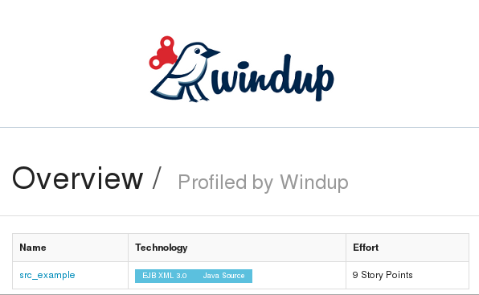
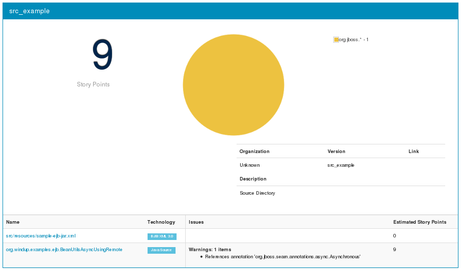
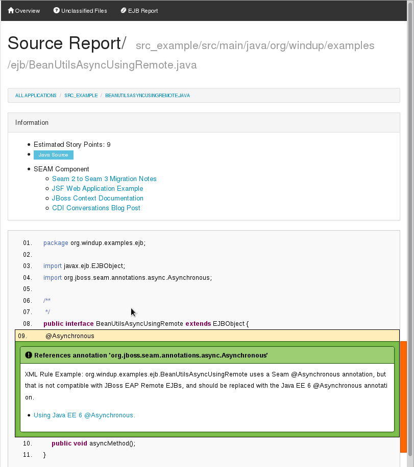

[[ejb-beanutils-async-xml-rule-that-detects-seam-asynchronous-annotation-in-remote-ejbs]]
= ejb-beanutils-async: XML Rule That Detects Seam Asynchronous Annotation in Remote EJBs

Author: Jess Sightler +
Level: Intermediate +
Summary: Windup XML-based rule that reports on reports on use of the Seam Asynchronous annotation in remote EJBs +
Source: https://github.com/windup/windup-quickstarts/ +

[[what-is-it]]
== What is it?

The Seam `@Asynchronous` annotation is not compatible with remote EJBs in Red Hat JBoss Enterprise Application Platform. 
This XML rule tests for use of `org.jboss.seam.annotations.async.Asynchronous` annotations in remote EJBs and reports that it must be replaced with the standard Java EE 6 `@Asynchronous` annotation.

*Note:* Windup only analyzes XML files with names ending in `.windup.xml`. Be sure to name XML-base rules using this naming convention!

These instructions use the following replaceable variables. 

* `WINDUP-HOME`: Replace this variable with the fully qualified path to your Windup installation.
* `QUICKSTART_HOME`: Replace this variable with the fully qualified path to the root directory of this quickstart.

[[review-the-quickstart-code]]
== Review the Quickstart Code

The `QUICKSTART_HOME/rules-xml/ejb-beanutils-async-method.windup.xml` rule first tests for XML file criteria and the filtered results are then used as input
for Java class criteria. The final results are assigned an effort level of 8.

* The `xmlfile` `<when>` condition tests for XML files with the "ejb" namespace prefix and matching the XPath `/ejb:ejb-jar//ejb:session[windup:matches(ejb:remote/text()`. The
`<remote>` element text value is stored in the variable `{{remoteclass}}` for later access by the `javaclass` condition.
* The `javaclass` `<when>` condition finds instances of the `{{remoteclass}}` named in the filtered results from the `xmlfile`
condition, looks for the referenced `org.jboss.seam.annotations.async.Asynchronous` annotation, and saves the results in the variable `asyncUsingSessionBeans`.
* When the condition is met, the `<perform>` action provides a hint message along with a link to more information and assigns it a level of
effort of "8".

The Windup JavaDoc is located here: http://windup.github.io/windup/docs/javadoc/latest/

The Windup rules schema is located here: https://github.com/windup/windup/blob/master/config-xml/rule-schema.xsd

[[system-requirements]]
== System requirements

The rule this project produces is designed to be run on Windup 2.0 or later.

This project requires Java 6.0 (Java SDK 1.6) or later and Maven 3.0 or later.
[[install-windup]]
== Install Windup

If you have not installed Windup, follow the instructions here: https://github.com/windup/windup/wiki/Install[Download and Install Windup].

[[add-the-quickstart-to-windup]]
== Add the Quickstart to Windup

To install the rule in Windup, simply copy the `QUICKSTART_HOME/rules-xml/ejb-beans-utils-async-usage-rule-provider.windup.xml`
and `QUICKSTART_HOME/rules-xml/ejb-beanutils-async-method.windup.xml` files into the `WINDUP_HOME/rules` directory.

[[test-the-quickstart-rule]]
== Test the Quickstart Rule

This quickstart provides example files containing the Seam `org.jboss.seam.annotations.async.Asynchronous` annotation to use when testing the quickstart. It is located in the quickstart's `test-files/src_example/` directory.

The command to test the rule uses this syntax:

----
windup-migrate-app [--sourceMode true] --input INPUT_ARCHIVE_OR_FOLDER --output OUTPUT_REPORT_DIRECTORY --packages PACKAGE_1 PACKAGE_2 PACKAGE_N
----

To test this quickstart using the `test-files/src_example/` folder provided in the root directory of this quickstart, follow these steps.

. Open a command prompt and navigate to the `WINDUP_HOME` directory.
. Type the following command to test the rule.
+
----
WINDUP_HOME/bin/windup -sourceMode true --input QUICKSTART_HOME/test-files/src_example/ --output QUICKSTART_HOME/windup-reports/ --packages org.windup
----
. You should see the following result:
+
----
***SUCCESS*** Windup report created: QUICKSTART_HOME/windup-reports/index.html
              Access it at this URL: file:///QUICKSTART_HOME/windup-reports/index.html
----

[[review-the-quickstart-report]]
== Review the Quickstart Report

. Open the `QUICKSTART_HOME/windup-reports/index.html` file in a browser.
+
You are presented with the following index page.
+
 +
. Click on the `src_example` link.
+
This opens an overview page showing a total of 9 story points and the list of the relevant files along with the warning messages, links to
obtain more information, and the estimated story points for each item.
+
_src/resources/sample-ejb-jar.xml_ shows 0 story points
+
_org.windup.examples.ejb.BeanUtilsAsyncUsingRemote_ show 9 story points
+
--------------------------------------------------------------------------------------
9 points for References annotation 'org.jboss.seam.annotations.async.Asynchronous'
--------------------------------------------------------------------------------------
+
 +
. Click on the file links to drill down and find more information.
+
The *Information* section reports on the matching conditions and provides a link to the standard Java EE servlet annotation documentation.
+
This is followed by the source code matching the condition with a detailed message desription.
+

[[remove-the-quickstart-rule-from-windup]]
== Remove the Quickstart Rule from Windup

To remove the rule from Windup, simply delete the `WINDUP_HOME/rules/ejb-beanutils-async-method.windup.xml` file from the `WINDUP_HOME/rules` directory.

