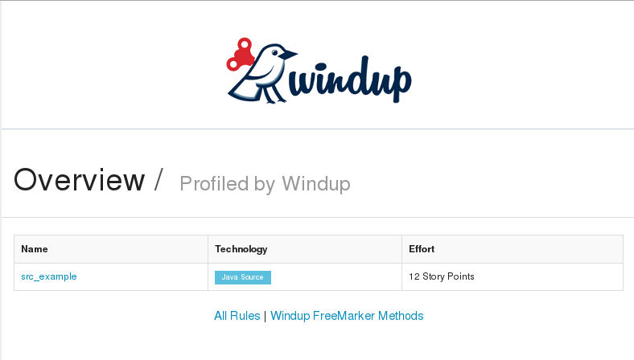
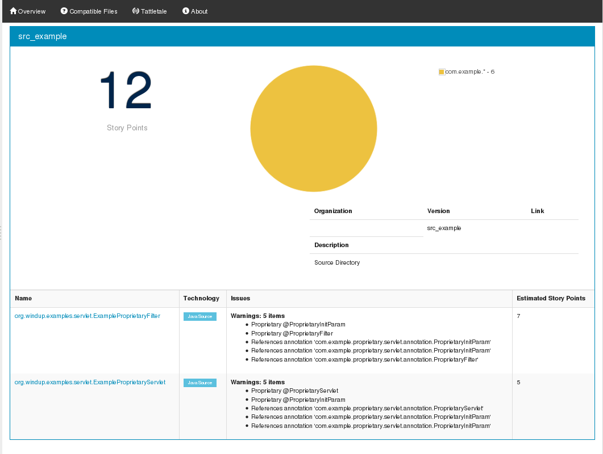
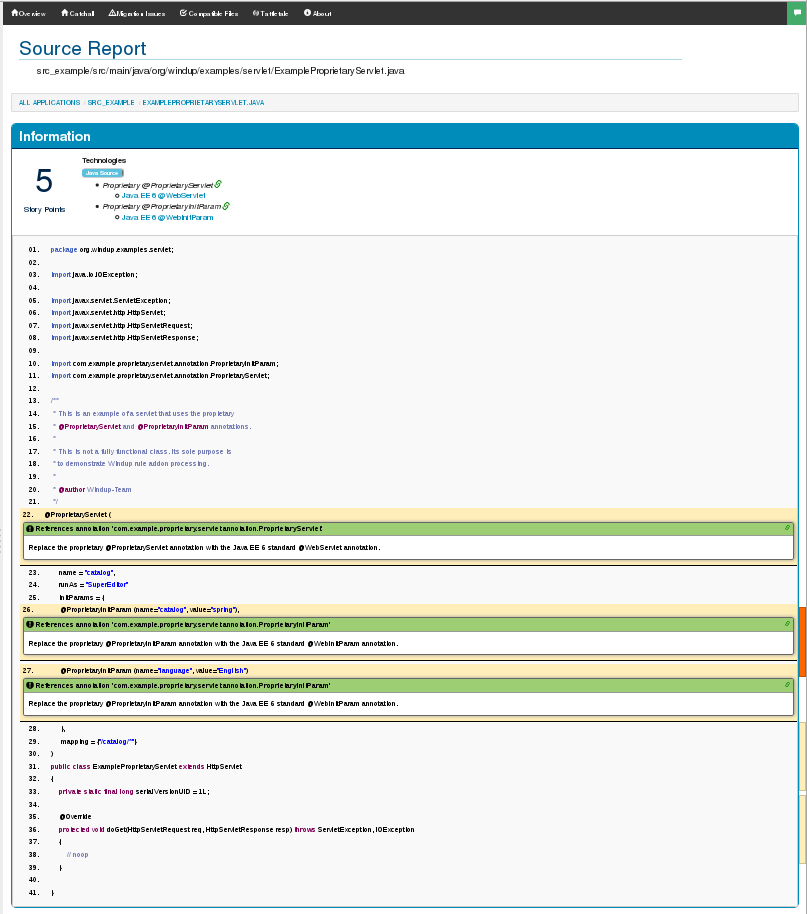
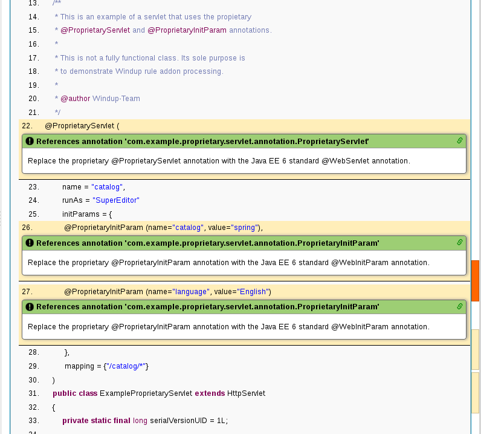

[[proprietary-javaee-servlet-java-based-rule-add-on-that-detects-proprietary-servlet-annotations]]
= proprietary-javaee-servlet: Java-based Rule Add-on That Detects Proprietary Servlet Annotations

Author: Ondra Zizka +
Level: Beginner +
Summary: Windup Java-based rule add-on that reports on Proprietary servlet annotations +
Source: https://github.com/windup/windup-quickstarts/ +

[[what-is-it]]
== What is it?

In this example, the fictional "Proprietary" corporation provides its own proprietary servlet and filter annotations for dependency injection. 
If the application uses them, they must be replaced with the standard Java EE 6 annotations. 
This example demonstrates how to create a Java-based RuleProvider that searches for these proprietary annotations and reports on them.

This Java-based Windup rule add-on searches for the following annotations:

* _@ProprietaryServlet_: This is the equivalent of the Java EE 6 _@WebServlet_ annotation.
* _@ProprietaryFilter_: This is the equivalent of the Java EE 6 _@WebFilter_ annotation.
* _@ProprietaryInitParam_: This is the equivalent of the Java EE 6 _@WebInitParam_ annotation.

These instructions use the following replaceable variables. 

* `WINDUP_HOME`: Replace this variable with the fully qualified path to your Windup installation.
* `QUICKSTART_HOME`: Replace this variable with the fully qualified path to the root directory of this quickstart.

[[review-the-quickstart-code]]
== Review the Quickstart Code

The _ProprietaryServletAnnotationRuleProvider_ class extends _RuleProvider_ and overrides the following methods:

* `getExecuteAfter()`: Nothing executes after this, so this method returns an empty list.
* `enhanceMetadata(Context context)`: This method specifies additional metadata about the Rule instances originating from this RuleProvider.
* `getConfiguration(GraphContext context)`: This method does the following.
* Adds a rule that looks for `com.example.proprietary.servlet.annotation.ProprietaryServlet` annotations. If found:
** Classifies the annotation as "Proprietary @ProprietaryServlet" and provides a link to the Java EE `javax.servlet.annotation` package Javadoc.
** Provides a warning text telling the user to replace the proprietary @ProprietaryServlet annotation with the Java EE 6 standard @WebServlet annotation.
** Assigns 1 story point of effort to this task.
* Adds a rule that looks for `com.example.proprietary.servlet.annotation.ProprietaryInitParam` annotations. If found:
** Classifies the annotation as "Proprietary @ProprietaryInitParam" and provides a link to the Java EE `javax.servlet.annotation` package Javadoc.
** Provides a warning text telling the user to replace the proprietary @ProprietaryInitParam annotation with the Java EE 6 standard @WebInitParam annotation.
** Assigns 2 story points of effort to this task.
* Adds a rule that looks for `com.example.proprietary.servlet.annotation.ProprietaryFilter` annotations. If found:
** Classifies the annotation as "Proprietary @ProprietaryFilter" and provides a link to the Java EE `javax.servlet.annotation` package Javadoc.
** Provides a warning text telling the user to replace the proprietary @ProprietaryFilter annotation with the Java EE 6 standard @WebFilter annotation.
** Assigns 3 story points of effort to this task.

The Windup JavaDoc is located here: http://windup.github.io/windup/docs/latest/javadoc/

[[system-requirements]]
== System requirements

The rule this project produces is designed to be run on Windup 2.x or later.

This project requires Java 7.0 (Java SDK 1.7) or later and Maven 3.0 or later.

[[install-windup]]
== Install Windup

If you have not installed Windup, follow the instructions here: https://github.com/windup/windup/wiki/Install[Download and Install Windup].

[[configure-maven]]
== Configure Maven

If you have not yet installed and configured Maven, follow the instructions here: https://github.com/windup/windup/wiki/Install-and-Configure-Maven[Install and Configure Maven].

An example `settings.xml` file is provided in the root directory of the quickstarts.

[[build-the-quickstart-rule]]
== Build the Quickstart Rule Add-on

Before Windup can use this rule, it must be compiled and added to the local Maven repository.

. Open a command prompt and navigate to the `QUICKSTART_HOME/rules-java/` directory.
. Type the following command to compile the quickstart and install it into the local Maven repository:
+
----
mvn clean install
----
. You should see the message `BUILD SUCCESS`

[[add-the-quickstart-to-windup]]
== Add the Quickstart to Windup

The command to install the rule in Windup uses the Maven GAV (groupId, artifactId, and optional version) to locate the rule in the Maven repository. The command uses the following syntax.

----
WINDUP_HOME/bin/windup --install GROUP_ID:ARTIFACT_ID[,VERSION]
----

To find these values, open the  QUICKSTART_HOME/rules-java/pom.xml file. These values are located near the beginning of the file.

[source,xml]
----
<groupId>org.jboss.windup.quickstarts</groupId>
<artifactId>windup-proprietary-javaee-servlet-rules-java</artifactId>
<version>2.4.0.Final</version>
----

Follow these steps to add the rule to Windup.

. Open a command prompt and navigate to the `WINDUP_HOME` directory.
. Type the following command, which does not include the optional version.
+
----
bin/windup --install org.jboss.windup.quickstarts:windup-proprietary-javaee-servlet-rules-java
----

. At the following prompt, choose `Y`.
+
----
Confirm installation [Y/n]? Y
----

. You should see the following result.
+
----
Installation completed successfully.
----
. Type `exit` to exit the Windup console.

[[test-the-quickstart-rule]]
== Test the Quickstart Rule

This quickstart provides an example source file containing Proprietary annotations to use when testing the quickstart. 
It is located in this quickstart's `test-files/src_example/` directory.

The command to test the rule uses this syntax:

----
WINDUP_HOME/bin/windup [--sourceMode] --input INPUT_ARCHIVE_OR_FOLDER --output OUTPUT_REPORT_DIRECTORY --packages PACKAGE_1 PACKAGE_2 PACKAGE_N
----

To test this quickstart using the `test-files/src_example/` folder provided in the root directory of this quickstart, follow these steps.

. Open a command prompt and navigate to the `WINDUP_HOME` directory.
. Type the following command to test the rule.
+
----
bin/windup --sourceMode --input QUICKSTART_HOME/test-files/src_example/ --output QUICKSTART_HOME/windup-reports/ --packages org.windup
----

. You should see the following result:
+
----
***SUCCESS*** Windup report created: QUICKSTART_HOME/windup-reports/index.html
              Access it at this URL: file:///QUICKSTART_HOME/windup-reports/index.html
----

[[review-the-quickstart-report]]
== Review the Quickstart Report

. Open the `QUICKSTART_HOME/windup-reports/index.html` file in a browser.
+
You are presented with the following Overview page containing the application profiles.
+
 +
. Click on the `src-example` link.
+
This opens a detail page showing a total of 12 story points and the list the files containing the proprietary annotations along with the warning messages, links to obtain more information, and the estimated story points for each item.
+
_org.windup.example.servlet.ExampleProprietaryFilter_ shows 7 story points
+
----
4 points, 2 points for each of the two @ProprietaryInitParam references
3 points for the @ProprietaryFilter reference
----
+
_org.windup.example.servlet.ExampleProprietaryServlet_ show 5 story points
+
----
4 points, 2 points for each of the two @ProprietaryInitParam references
1 points for the @ProprietaryServlet reference  
----
+
 +
. Click on the file links to drill down and find more information.
+
The *Information* section reports the proprietary annotations and provides a link to the standard Java EE servlet annotation documentation.
+
 +
+
The *Hint* text appears at the appropriate locations within the code.
+
 +
. Explore the contents of the `windup-reports-java` folder. For example, the `windup-reports-java/reports/ruleproviders.html` page lists the details of the rule provider executions.

[[run-the-quickstart-arquillian-tests]]
== Run the Quickstart Arquillian Tests

This quickstart provides Arquillian tests.

. Open a command prompt and navigate to the `QUICKSTART_HOME/rules-java/` directory.
. Type the following command to run the test goal.
+
----
mvn clean test
----
. You should see the following results.
+
----
Results :

Tests run: 1, Failures: 0, Errors: 0, Skipped: 0
----

[[remove-the-quickstart-from-windup]]
== Remove the Quickstart from Windup

You remove the rule from Windup using its Maven GAV (groupId, artifactId, and version).
 
The command takes the following form:
----
WINDUP_HOME/bin/windup --remove GROUP_ID:ARTIFACT_ID[,VERSION]
----

Follow these steps to remove the rule to Windup.

. Open a command prompt and navigate to the `WINDUP_HOME` directory.
. Type the following command.
+
----
bin/windup --remove org.jboss.windup.quickstarts:windup-proprietary-javaee-servlet
----

. You should see the following response.
+
----
Uninstallation completed successfully.
----

