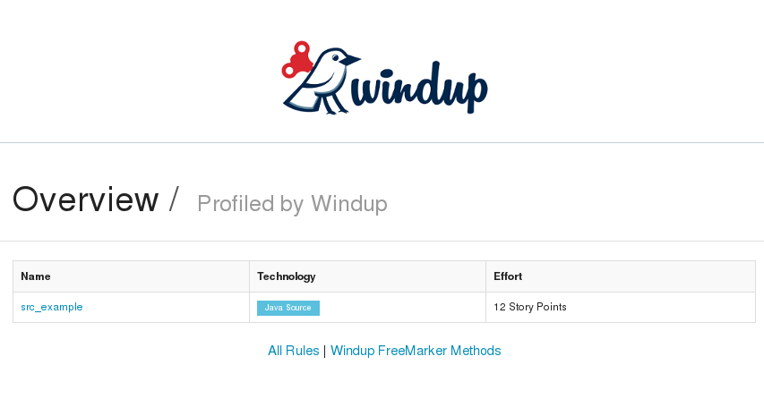
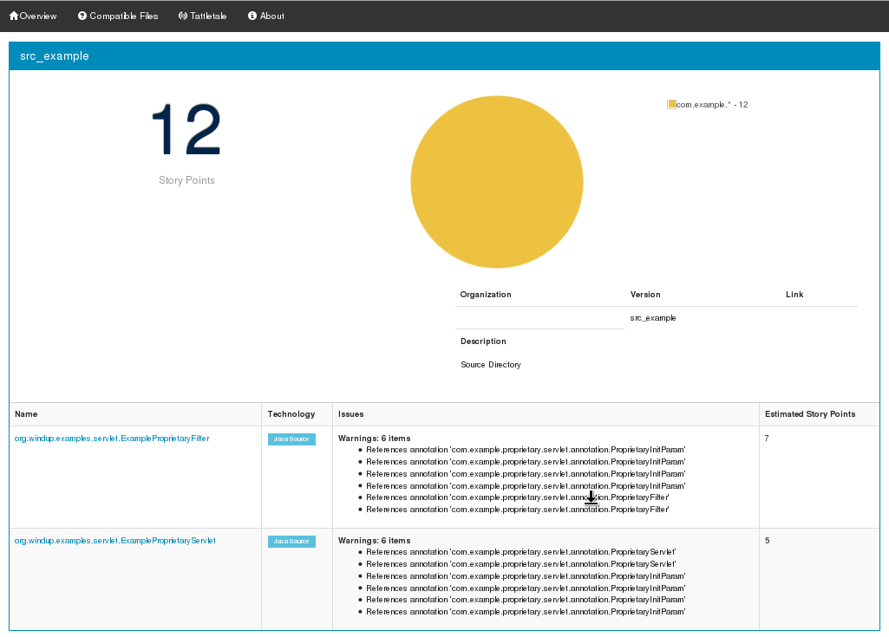
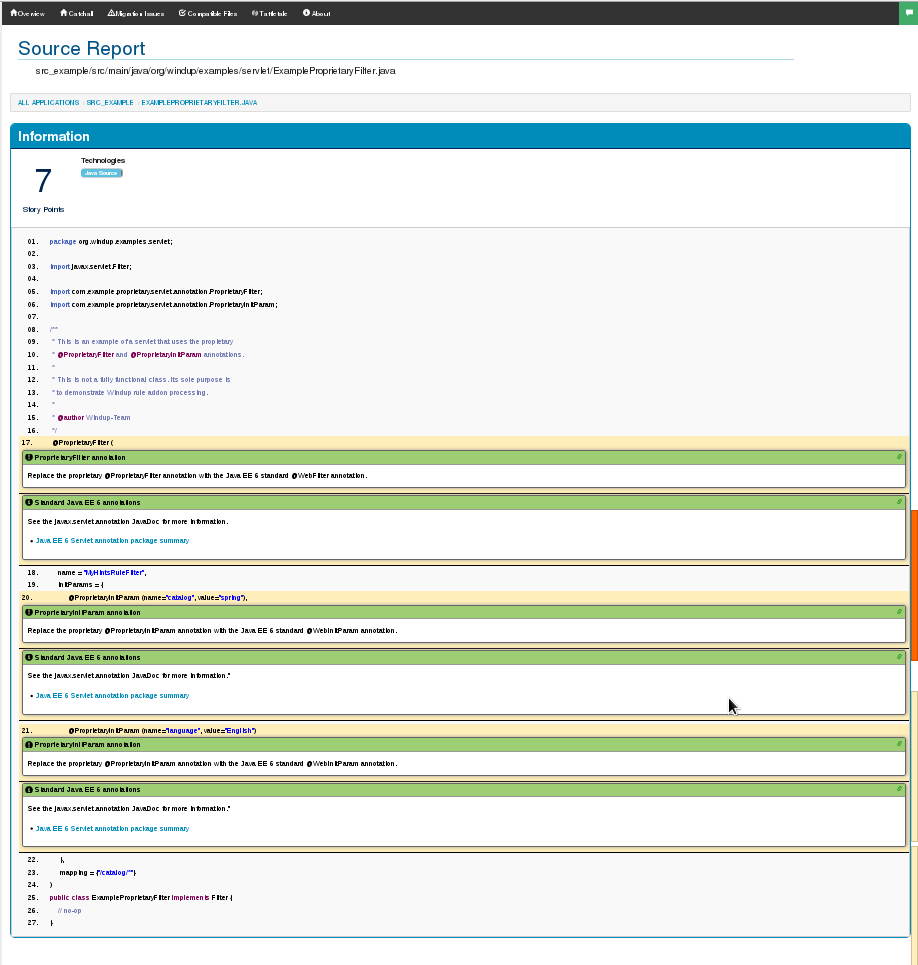

[[proprietary-javaee-servlet-xml-based-rule-that-detects-proprietary-servlet-annotations]]
= proprietary-javaee-servlet: XML-based Rule That Detects Proprietary Servlet Annotations

Author: Windup Team +
Level: Beginner +
Summary: Windup XML-based rule that reports on Proprietary servlet annotations +
Source: https://github.com/windup/windup-quickstarts/ +

[[what-is-it]]
== What is it?

In this example, the fictional "Proprietary" corporation provides its own proprietary servlet and filter annotations for dependency injection. 
If the application uses them, they must be replaced with the standard Java EE 6 annotations. 
This example demonstrates how to create an XML-based rule that searches for these proprietary annotations and reports on them.

This XML-based Windup rule searches for the following annotations:

* _@ProprietaryServlet_: This is the equivalent of the Java EE 6 _@WebServlet_ annotation.
* _@ProprietaryFilter_: This is the equivalent of the Java EE 6 _@WebFilter_ annotation.
* _@ProprietaryInitParam_: This is the equivalent of the Java EE 6 _@WebInitParam_ annotation.

*Note:* Windup only analyzes XML files with names ending in `.windup.xml`. Be sure to name XML-base rules using this naming convention!

These instructions use the following replaceable variables. 

* `QUICKSTART_HOME`: Replace this variable with the fully qualified path to the root directory of this quickstart.
* `WINDUP_HOME`: Replace this variable with the fully qualified path to your Windup installation.
* `WINDUP_RULES_DIR`: Replace this variable with the fully qualified path to your `${user.home}/.windup/rules/` directory. This directory is created by Windup the first time it is executed and contains rules, add-ons, and the Windup log.
+
[options="nowrap"]
----
For Linux or Mac: ~/.windup/rules/
For Windows: "\Documents and Settings\USER_NAME\.windup\rules\" or "\Users\USER_NAME\.windup\rules\"
----

A {ProductShortName} rule is installed simply by copying the XML rule to the `WINDUP_RULES_DIR` folder. 

[[review-the-quickstart-code]]
== Review the Quickstart Code

The QUICKSTART_HOME/rules-xml/proprietary-servlet-annotations.windup.xml ruleset contains 3 rules. Each rule tests for a Java class reference to a Proprietary servlet annotation and provides a message about to migrate the code.

* A `<rule>` elements is defined for each of the above Proprietary Servlet annotations. Each `rule` contains the following elements.
* The `<when>` looks for a `javaclass` for the specific Proprietary annotation, for example, `com.example.proprietary.servlet.annotation.ProprietaryServlet`, `com.example.proprietary.servlet.annotation.ProprietaryInitParam`, or `com.example.proprietary.servlet.annotation.ProprietaryFilter`, with a location `ANNOTATION`.
* On a match, the `<perform>` element provides a `<hint>` message and description with links to documentation.

The Windup JavaDoc is located here: http://windup.github.io/windup/docs/latest/javadoc/

The Windup rules schema is located here: http://windup.jboss.org/schema/windup-jboss-ruleset.xsd

[[system-requirements]]
== System requirements

The rule this project produces is designed to be run on Windup 2.0 or later.

This project requires Java 7.0 (Java SDK 1.7) or later.

[[install-windup]]
== Install Windup

If you have not installed Windup, follow the instructions here: https://github.com/windup/windup/wiki/Install[Download and Install Windup].

[[add-the-quickstart-to-windup]]
== Add the Quickstart to Windup

To install the rule in Windup, simply copy the `QUICKSTART_HOME/rules-xml/proprietary-servlet-annotations.windup.xml` file into the `WINDUP_RULES_DIR` directory.

[options="nowrap"]
----
cd QUICKSTART_HOME/rules-xml
cp proprietary-servlet-annotations.windup.xml ~/.windup/rules/
----

[[test-the-quickstart-rule]]
== Test the Quickstart Rule

This quickstart provides an example source file containing Proprietary annotations to use when testing the quickstart. It is located in this quickstart's `test-files/src_example/` directory.

The command to test the rule uses this syntax:

----
WINDUP_HOME/bin/windup [--sourceMode] --input INPUT_ARCHIVE_OR_FOLDER --output OUTPUT_REPORT_DIRECTORY --target TARGET_TECHNOLOGY --packages PACKAGE_1 PACKAGE_2 PACKAGE_N
----

To test this quickstart using the `test-files/src_example/` folder provided in the root directory of this quickstart, follow these steps.

. Open a command prompt and navigate to the `WINDUP_HOME` directory.
. Type the following command to test the rule.
+
----
bin/windup --sourceMode --input QUICKSTART_HOME/test-files/src_example/ --output QUICKSTART_HOME/windup-reports-xml/ --target eap --packages org.windup
----

. You should see the following result:
+
----
***SUCCESS*** Windup report created: QUICKSTART_HOME/windup-reports-xml/index.html
              Access it at this URL: file:///QUICKSTART_HOME/windup-reports-xml/index.html
----

[[review-the-quickstart-report]]
== Review the Quickstart Report

. Open the `QUICKSTART_HOME/windup-reports-xml/index.html` file in a
browser. You are presented with the following index page.
+
====
*Overview*
 
====
. Click on the `src_example` link.
+
This opens a detail page showing a total of 12 story points and the list the files containing the proprietary annotations along with the warning messages, links to obtain more information, and the estimated story points for each item.
+
_org.windup.example.servlet.ExampleProprietaryFilter_ shows 7 story points and 6 warning items.
+
_org.windup.example.servlet.ExampleProprietaryServlet_ show 5 story points and 6 warning items.
+
====
*Application Report*
 +
====
. Click on each file link to drill down for more information.
+
The *Information* section reports the proprietary annotations and provides a link to the standard Java EE servlet annotation documentation. The *Hint* text appears at the appropriate locations within the code.
+
====
*Source report: src_example/src/main/java/org/windup/examples/servlet/ExampleProprietaryFilter.java*
 
====
+
====
*Source report: src_example/src/main/java/org/windup/examples/servlet/ExampleProprietaryServlet.java*
image:../images/proprietary-javaee-servlet-xml-rule-sourcereportdetail.png[Source Report Detail page] +
====
. Explore the contents of the `windup-reports-xml` folder. For example, the `windup-reports-xml/reports/ruleproviders.html` page lists the details of the rule provider executions.

[[remove-the-quickstart-from-windup]]
== Remove the Quickstart from Windup

To remove the rule from Windup, simply delete the `proprietary-servlet-annotations.windup.xml` file from the `WINDUP_RULES_DIR` directory.

