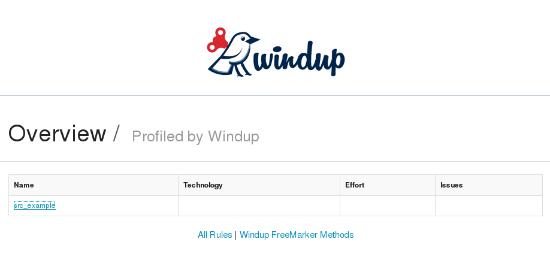

weblogic-javaee-servlet: Java-based Rule Addon That Detects WebLogic Proprietary Servlet Annotations
=============================================================================================
Author: Ondra Zizka  
Level: Beginner  
Technologies: Java-based rule
Summary: Windup Java-based rule addon that reports on WebLogic servlet annotations  
Target Product: Windup  
Product Versions: 2.0  
Source: <https://github.com/windup/windup-quickstarts/>  

What is it?
-----------

WebLogic provides its own proprietary servlet and filter annotations for dependency injection. If the application uses them, they must be replaced with the standard Java EE 6 annotations. This example demonstrates how to create a WindupRuleProvider that searches for these proprietary annotations and reports on them.

This Java-based Windup rule addon searches for the following annotations:

* *@WLServlet*: This is the equivalent of the Java EE 6 *@WebServlet* annotation.

* *@WLFilter*: This is the equivalent of the Java EE 6 *@WebFilter* annotation.

* *@WLInitParam*: This is the equivalent of the Java EE 6 *@WebInitParam* annotation.

Review the Quickstart Code
-------------------------

The *MyHintsRuleProvider* class extends *WindupRuleProvider* and overrides the following methods:

* `getExecuteAfter()`: Nothing executes after this, so this method returns an empty list.

* `enhanceMetadata(Context context)`: This method specifies additional metadata about the Rule instances originating from this WindupRuleProvider.

* `getConfiguration(GraphContext context)`: This method does the following.

   * Adds a rule that looks for `weblogic.servlet.annotation.WLServlet` annotations. If found:

        * Classifies the annotation as "WebLogic @WLServlet" and provides a link to the Java EE `javax.servlet.annotation` package Javadoc.
        * Provides a warning text telling the user to replace the proprietary WebLogic @WLServlet annotation with the Java EE 6 standard @WebServlet annotation and provides a link to an article on the Red Hat Customer Portal.
        * Assigns 1 story point of effort to this task.
   * Adds a rule that looks for `weblogic.servlet.annotation.WLInitParam` annotations. If found:

        * Classifies the annotation as "WebLogic @WLInitParam" and provides a link to the Java EE `javax.servlet.annotation` package Javadoc.
        * Provides a warning text telling the user to replace the proprietary WebLogic @WLInitParam annotation with the Java EE 6 standard @WebInitParam annotation and provides a link to an article on the Red Hat Customer Portal.
        * Assigns 2 story points of effort to this task.

   * Adds a rule that looks for `weblogic.servlet.annotation.WLFilter` annotations. If found:

        * Classifies the annotation as "WebLogic @WLFilter" and provides a link to the Java EE `javax.servlet.annotation` package Javadoc.
        * Provides a warning text telling the user to replace the proprietary WebLogic @WLFilter annotation with the Java EE 6 standard @WebFilter annotation and provides a link to an article on the Red Hat Customer Portal.
        * Assigns 3 story points of effort to this task.

The Windup Javadoc is located here: <http://windup.github.io/windup/docs/javadoc/latest/>

System requirements
-------------------

The rule this project produces is designed to be run on Windup 2.0 or later.

This project requires Java 6.0 (Java SDK 1.6) or later and Maven 3.0 or later.

 
Install Windup 2.0
------------------

If you have not yet done so, follow the instructions to [Download and install Windup](https://github.com/windup/windup/wiki/Install-Windup).

Configure Maven
---------------

If you have not yet done so, you must configure your Maven settings to access the Windup artifacts. The instructions are located here: [Install and Configure Maven](https://github.com/windup/windup/wiki/Install-and-Configure-Maven).

An example `settings.xml` file is provided  in the root directory of the quickstarts.

Start Windup
------------

1. Open a terminal and navigate to the `WINDUP_HOME/bin` directory, where `WINDUP_HOME` denotes the path to the Windup installation.

2. Type the following command to start Windup:

        For Linux:    WINDUP_HOME/bin $ ./windup
        For Windows:  C:\WINDUP_HOME\bin> windup

3. You are presented with the following prompt.

        Using Windup at /home/username/windup-distribution-2.0.0.Final
        
         _       ___           __          
        | |     / (_)___  ____/ /_  ______ 
        | | /| / / / __ \/ __  / / / / __ \
        | |/ |/ / / / / / /_/ / /_/ / /_/ /
        |__/|__/_/_/ /_/\__,_/\__,_/ .___/ 
                                  /_/      
        
        JBoss Windup, version [ 2.0.0.Final ] - JBoss, by Red Hat, Inc. [ http://windup.jboss.org ]
        
        [windup-distribution-2.0.0.Final]$ 

4. This prompt is the Windup console where you enter Windup commands.

Add the Quickstart to Windup
----------------------------

* [Build and Install the Quickstart as a Windup Addon in One Simple Step](#build-and-install-the-quickstart-as-a-windup-addon-in-one-simple-step): You can build and install the quickstart into the Maven repository and install it into Windup in one simple step. This is the fastest way to install a rule addon into Windup. 

* [Install the Quickstart into the Local Maven Repository](#install-the-quickstart-into-the-local-maven-repository): Follow these instructions to build and install the quickstart into the Maven repository using Maven command line. Use these instructions if you need specific build options. 

* [Install the Quickstart into Windup as an Addon](#install-the-quickstart-into-windup-as-an-addon): If you build the quickstart using Maven, follow these instructions to install the quickstart into Windup as a rule addon.

### Build and Install the Quickstart as a Windup Addon in One Simple Step

This is the easiest and fastest way to build the quickstart, install it into the local Maven repository, and install it into Windup as a rule addon.

1. If you have not started Windup, follow the instructions above to [Start Windup](#start-windup).

2. Build the quickstart and install the addon in Windup using the `addon-build-and-install` command in the Windup console. 

  The command uses the following syntax, where `QUICKSTART_HOME` refers the root directory of this `weblogic-javaee-servlet` quickstart:

        addon-build-and-install --projectRoot QUICKSTART_HOME/rules-java
        
   For example:
   
        addon-build-and-install --projectRoot /home/username/windup-quickstarts/weblogic-javaee-servlet/rules-java
        
   You should see the following result.
   
        ***SUCCESS*** Addon org.jboss.windup.quickstarts:windup-weblogic-javaee-servlet:::2.0.0.Final was installed successfully.
3. You can now skip the next two sections and proceed to [Test the Quickstart Rule Addon](#test-the-quickstart-rule-addon).

### Install the Quickstart into the Local Maven Repository

Use these instructions to build the quickstart using the Maven command line and install it into your local Maven repository. This is useful if you need to use specific build options other than the default.

1. Open a command prompt and navigate to this quickstart's `rules-java/` directory.
2. Type this command to build and install the rule in your local Maven repository:

        mvn clean install
        
3. The quickstart is now installed in the local Maven repository. Continue to the next section to [Install the Quickstart into Windup as an Addon](#install-the-quickstart-into-windup-as-an-addon).

### Install the Quickstart into Windup as an Addon

After you build the quickstart and install it into the local Maven repository, use these instructions to install it into Windup as a rule addon.

1. If you have not started Windup, follow the instructions above to [Start Windup](#start-windup).

2. Be sure to navigate to this quickstart's `rules-java/` directory.

3. Add the rule to Windup using the `addon-install` command in the Windup console.

  Type the following command at the Windup prompt:

        addon-install  

  Windup responds with this prompt: 

        Coordinate (The addon's "groupId:artifactId,version" coordinate):
4.  The `groupId`, `artifactId`, and `version` are specified in the quickstart `pom.xml` file. At the prompt, enter the following response:
       
        org.jboss.windup.quickstarts:windup-weblogic-javaee-servlet,2.0.0.Final

   You should see the following result:

        ***SUCCESS*** Addon org.jboss.windup.quickstarts:windup-weblogic-javaee-servlet,2.0.0.Final was installed successfully.
5. You can now [Test the Quickstart Rule Addon](#test-the-quickstart-rule-addon).

Test the Quickstart Rule Addon
------------------------------

This quickstart provides an example source file containing WebLogic annotations to use when testing the quickstart. It is located in this quickstart's `test-files/src_example/` directory.

1. If you have not started Windup, follow the instructions above to [Start Windup](#start-windup).

2. Test the Java-based rule addon against the WebLogic application file by running the `windup-migrate-app` command at the Windup prompt. 

  The command uses this syntax:

        windup-migrate-app [--sourceMode true] --input INPUT_ARCHIVE_OR_FOLDER --output OUTPUT_REPORT_DIRECTORY --packages PACKAGE_1 PACKAGE_2 PACKAGE_N

  To test this quickstart using the `test-files/src_example/src/main/java/org/windup/examples/servlet/SampleWebLogicServlet.java` example file provided in the root directory of this quickstart, type the following commmand. Be sure to replace `QUICKSTART_HOME` with the fully qualified path to this quickstart.
    
        windup-migrate-app --sourceMode true --input QUICKSTART_HOME/test-files/src_example/ --output QUICKSTART_HOME/windup-reports-java --packages org.windup

  You should see the following result:
 
        ***SUCCESS*** Windup report created: QUICKSTART_HOME/windup-reports-java/index.html
                      Access it at this URL: file:///QUICKSTART_HOME/windup-reports-xml/index.html

  
For more information about how to run Windup, see: [Execute Windup](https://github.com/windup/windup/wiki/Execute-Windup). 

Review the Quickstart Report
----------------------------

1. Open the `QUICKSTART_HOME/windup-reports-java/index.html` file in a browser.  

   You are presented with the following Overview page containing the application profiles.  

  
2. Click on the `test-files` link.  

   This opens a detail page showing a total of 12 story points and the list the files containing the WebLogic proprietary annotations along with the warning messages, links to obtain more information, and the estimated story points for each item.  

*org.windup.example.servlet.SampleWebLogicFilter* shows 7 story points

        4 points, 2 points for each of the two @WLInitParam references
        3 points for the @WLFilter reference
       
*org.windup.example.servlet.SampleWebLogicServlet* show 5 story points

        4 points, 2 points for each of the two @WLInitParam references
        1 points for the @WLServlet reference  

  
3. Click on the file links to drill down and find more information.  

* The **Information** section reports the proprietary annotations and provides a link to the standard Java EE servlet annotation documentation.

* The **Hint** text appears at the appropriate locations within the code and provides a link to the [Migrate WebLogic Proprietary Servlet Annotations](https://access.redhat.com/articles/1249423) article on the Red Hat Customer Portal.

  
4. Explore the contents of the `windup-reports-java` folder. For example, the `windup-reports-java/reports/ruleproviders.html` page lists the details of the rule provider executions. 

Remove the Quickstart from Windup
---------------------------------

Remove the quickstart rule addon from Windup using the `addon-remove` command.

1. If you have not started Windup, follow the instructions above to [Start Windup](#start-windup).

2. Type the following command at the Windup prompt:

        addon-remove  

3. Windup responds with a list of installed add-ons.

        [0] - org.jboss.forge.furnace.container:cdi,2.12.1.Final
        [1] - org.jboss.windup.quickstarts:windup-weblogic-javaee-servlet,2.0.0.Final
        
        Installed addons (The installed addons in mutable addon repositories that may be removed): [0-1] 

4. Choose the number of this rule addon, in this case, type `1` and hit enter. Then leave it blank and hit enter to finish. You should see:

        ***SUCCESS*** Removed addons: org.jboss.windup.quickstarts:windup-weblogic-javaee-servlet,2.0.0.Final

Stop Windup
-----------

To stop Windup, type the following command in the Windup console:

        exit

Run the Quickstart Arquillian Tests 
-------------------------

This quickstart provides Arquillian tests. 

1. Open a command prompt and navigate to the root directory of this quickstart.
2. Type the following command to run the test goal:

        mvn clean test
3. You should see the following results.

        Results :

        Tests run: 1, Failures: 0, Errors: 0, Skipped: 0

