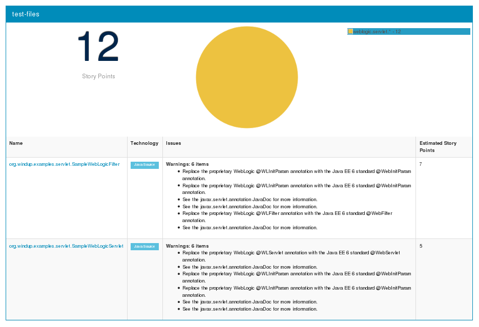
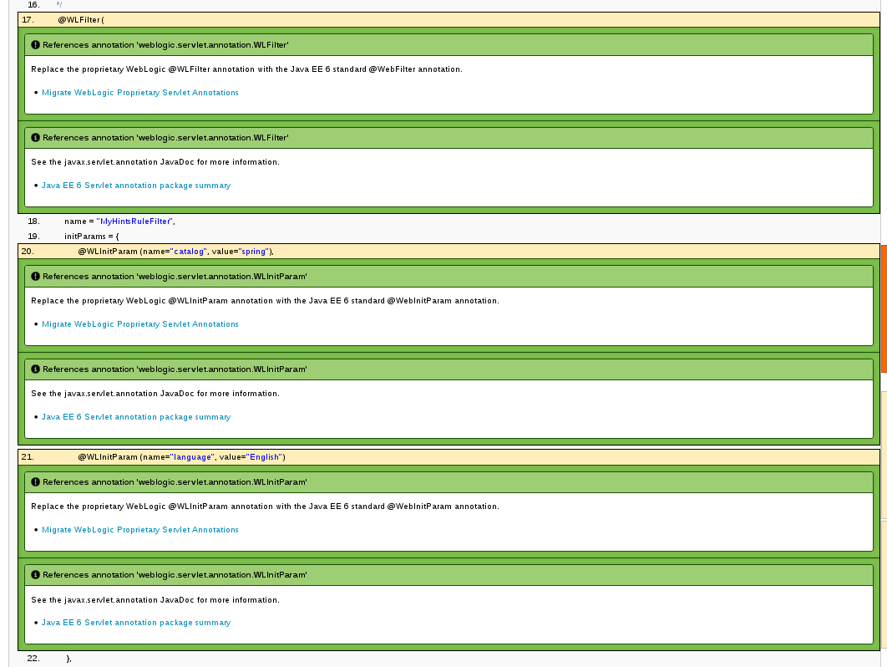

weblogic-javaee-servlet: XML-based Rule That Detects WebLogic Proprietary Servlet Annotations
=============================================================================================
Author: Windup Team  
Level: Beginner  
Technologies: XML-based rule
Summary: Windup XML-based rule that reports on WebLogic servlet annotations  
Target Product: Windup  
Product Versions: 2.0  
Source: <https://github.com/windup/windup-quickstarts/>  

What is it?
-----------

WebLogic provides its own proprietary servlet and filter annotations for dependency injection. If the application uses them, they must be replaced with the standard Java EE 6 annotations. This example demonstrates how to create a WindupRuleProvider that searches for these proprietary annotations and reports on them.

This XML-based Windup rule searches for the following annotations:

* *@WLServlet*: This is the equivalent of the Java EE 6 *@WebServlet* annotation.

* *@WLFilter*: This is the equivalent of the Java EE 6 *@WebFilter* annotation.

* *@WLInitParam*: This is the equivalent of the Java EE 6 *@WebInitParam* annotation.

Review the Quickstart Code
-------------------------

**Note:** Windup only analyzes XML files with names ending in `.windup.xml`. Be sure to name XML-base rules using this naming convention!

The QUICKSTART_HOME/rules-xml/my-hints-rule-provider.windup.xml file contains the following elements:

* The `<ruleset>` element defines this as a Windup rule.

* The `<rules>` element contains the individual rules.

* A `<rule>` elements is defined for each of the above WebLogic Servlet annotations. Each `rule` contains the following elements.

   * The `<when>` looks for a javaclass for the specific WebLogic annotation, for example, `weblogic.servlet.annotation.WLServlet`, `weblogic.servlet.annotation.WLInitParam`, or `weblogic.servlet.annotation.WLFilter`, with a location `ANNOTATION`.
   * On a match, the `<perform>` element provides a `<hint>` message and description with links to documentation.

The Windup Javadoc is located here: <http://windup.github.io/windup/docs/javadoc/latest/>

System requirements
-------------------

The rule this project produces is designed to be run on Windup 2.0 or later.

This project requires Java 6.0 (Java SDK 1.6) or later and Maven 3.0 or later.

 
Install Windup 2.0
------------------

If you have not yet done so, follow the instructions to [Download and install Windup](https://github.com/windup/windup/wiki/Install-Windup).

Start Windup
------------

1. Open a terminal and navigate to the `WINDUP_HOME/bin` directory, where `WINDUP_HOME` denotes the path to the Windup installation.

2. Type the following command to start Windup:

        For Linux:    WINDUP_HOME/bin $ ./windup
        For Windows:  C:\WINDUP_HOME\bin> windup

3. You are presented with the following prompt.

        Using Windup at /home/username/windup-distribution-2.0.0.Beta4
        
         _       ___           __          
        | |     / (_)___  ____/ /_  ______ 
        | | /| / / / __ \/ __  / / / / __ \
        | |/ |/ / / / / / /_/ / /_/ / /_/ /
        |__/|__/_/_/ /_/\__,_/\__,_/ .___/ 
                                  /_/      
        
        JBoss Windup, version [ 2.0.0.Beta4 ] - JBoss, by Red Hat, Inc. [ http://windup.jboss.org ]
        
        [windup-distribution-2.0.0.Beta4]$ 

4. This prompt is the Windup console where you enter Windup commands.

Add the Quickstart to Windup
----------------------------

To install the rule in Windup, simply copy the `QUICKSTART_HOME/rules-java/my-hints-rule-provider.windup.xml` file into the `WINDUP_HOME/rules` directory.

Test the Quickstart Rule
------------------------

This quickstart provides an example source file containing WebLogic annotations to use when testing the quickstart. It is located in this quickstart's `test-files/src_example/` directory.

1. If you have not started Windup, follow the instructions above to [Start Windup](#start-windup).

2. Test the XML-based rule against the WebLogic application file by running the `windup-migrate-app` command at the Windup prompt. 

  The command uses this syntax:

        windup-migrate-app [--sourceMode true] --input INPUT_ARCHIVE_OR_FOLDER --output OUTPUT_REPORT_DIRECTORY --packages PACKAGE_1 PACKAGE_2 PACKAGE_N

  To test this quickstart using the `test-files/src_example/src/main/java/org/windup/examples/servlet/SampleWebLogicServlet.java` example file provided in the root directory of this quickstart, type the following commmand. Be sure to replace `QUICKSTART_HOME` with the fully qualified path to this quickstart.
    
        windup-migrate-app --sourceMode true --input QUICKSTART_HOME/test-files/src_example/ --output QUICKSTART_HOME/windup-reports-xml --packages org.windup

  You should see the following result:
 
        ***SUCCESS*** Windup report created: QUICKSTART_HOME/windup-reports-xml/index.html

  
For more information about how to run Windup, see: [Execute Windup](https://github.com/windup/windup/wiki/Execute-Windup). 

Review the Quickstart Report
----------------------------

1. Open the `QUICKSTART_HOME/windup-reports-xml/index.html` file in a browser.  

   You are presented with the following Overview page containing the application profiles.  

  
2. Click on the `test-files` link.  

   This opens a detail page showing a total of 12 story points and the list the files containing the WebLogic proprietary annotations along with the warning messages, links to obtain more information, and the estimated story points for each item.  

*org.windup.example.servlet.SampleWebLogicFilter* shows 7 story points

        4 points, 2 points for each of the two @WLInitParam references
        3 points for the @WLFilter reference
       
*org.windup.example.servlet.SampleWebLogicServlet* show 5 story points

        4 points, 2 points for each of the two @WLInitParam references
        1 points for the @WLServlet reference  

  
3. Click on the file links to drill down and find more information.  

* The **Information** section reports the proprietary annotations and provides a link to the standard Java EE servlet annotation documentation.

* The **Hint** text appears at the appropriate locations within the code and provides a link to the [Migrate WebLogic Proprietary Servlet Annotations](https://access.redhat.com/articles/1249423) article on the Red Hat Customer Portal. Additional **Hint** text provides links to the javax.servlet.annotation package [Javadoc](http://docs.oracle.com/javaee/6/api/javax/servlet/annotation/package-summary.html).

  

Remove the Quickstart from Windup
---------------------------------

To remove the rule from Windup, simply delete the `WINDUP_HOME/rules/my-hints-rule-provider.windup.xml` file.

Stop Windup
-----------

To stop Windup, type the following command in the Windup console:

        exit

